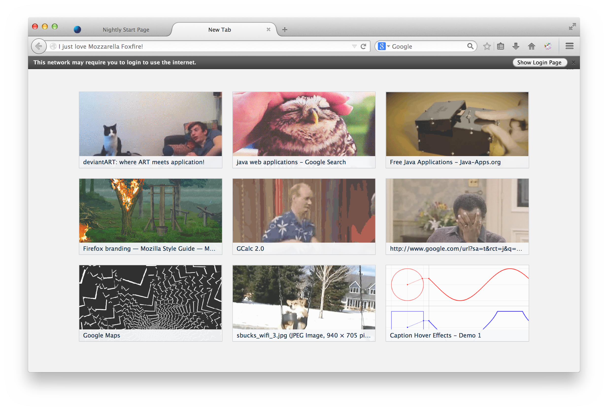

# Captive Portal Design Spec

## Captive portal tab

A tab is considered a captive portal tab if one of the following situations is
true:
- A captive portal is automatically opened
- A new tab page is replaced by a captive portal
- A captive portal is opened manually (i.e. button click in status bar or SSL
  error page).

A captive portal tab ceases to be a captive portal tab if the user interacts
with the tab in a way which causes the tab to navigate to a page other than the
captive portal. For example:
- Typing in a page in the URL bar
- Clicking a link in the captive portal

## A captive portal detected after connecting to a network.

Open the detected captive portal automatically in a new tab in the active window.
This can be seen in Figure 1.

**Figure 1:** Captive portal login automatically opened.

### Security Issues

A malicious attacker may attempt to automatically open a malicious tab and run
arbitrary code/steal cookies on a network such as this. See
*[OS X Lion Captive Portal Hijacking Attack][cnaHijack]* for more information.

[cnaHijack]:http://www.infosecisland.com/blogview/17138-OS-X-Lion-Captive-Portal-Hijacking-Attack.html

## A captive portal is detected but not logged in

Display status bar indicator indicating the network requires a login as shown in
Figure 2. The status bar will be dismissed once the captive portal has been
logged into.

Pressing "Open Login Page" will open a new tab and display the login page.
If the captive portal is already open, switch to the tab.

Pressing the close button will close the status bar for all tabs in all windows.

**Figure 2:** Login prompt with a status bar.

Upon opening a new tab, the user will be presented with the login page for the
captive portal instead of the usual new tab behaviour. This is shown in
Figure 3.

If the user wishes to open the new tab page, they can do so with the button in
the status bar shown. Pressing "show new tab" should open the usual new tab
page as shown in Figure 4. This status bar should be tab specific unlike the one
shown in Figure 2.

Pressing "show login page" in Figure 4 should switch back to the captive portal.

**Figure 3:** Captive portal login replaces new tab.

**Figure 4:** Normal new tab page shown

## Restoring sessions

If Firefox is starting and the user will be prompted to restore their tabs
(e.g. after a crash), show the restore tabs button along with the captive portal
login to the right of it.

If Firefox is automatically going to open all of the previously open tabs upon
starting, then also display a captive portal login tab.

## Captive portal tampering with SSL connections

If a captive portal is detected and a page with an SSL connection is being
loaded and appears to be tampered with, display an alternative warning page
as shown Figure 5. This error page would behave as the existing about:certerror
page.

Pressing "open login page" would open the captive portal in a new tab. Similar
to the status bar button, if the captive portal is already open, switch to the
tab.

**Figure 5:** Network portal interference.

## Cycling WiFi Networks

Sometimes a user may cycle wifi networks in order to find a suitable internet
connection. In the process multiple captive portals may be detected. In order
to prevent many tabs being open, if an existing captive portal is already open
overwrite it when a new captive portal is detected.

## Interaction with system captive portal detection

A through writeup on how different operating systems detect captive portals can
be found in [detection.md](../detection.md).

Firefox captive portal detection should assume the user may authenticate with
a captive portal outside of Firefox (e.g other browser, or system interaction).
It should attempt to update the captive portal state as best as it can in these
scenarios and hide any captive portal UI elements once the user is not behind
a captive portal anymore.

### Windows

Windows only shows a system tray popup, so nothing in particular needs to be
addressed in this design. The popup will show and Firefox will behave as defined
in this spec.

### Mac OS X

Starting in Mac OS X 10.7, a window will appear when a captive portal has been
detected by the OS.

This may cause duplicated captive portals on the screen. If it's possible,
Firefox should watch to see if Captive Network Assistant opens a captive portal.
If it does, there is no need to automatically open it in Firefox. However, if
the system does not properly detect a captive portal, Firefox should behave as
defined in this spec.
