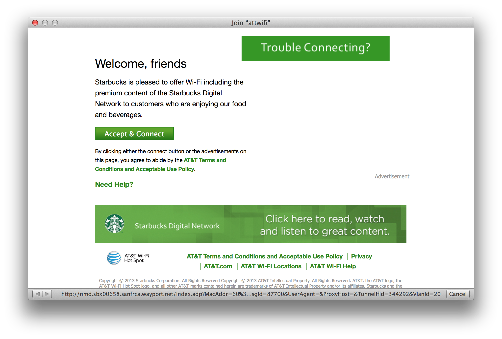

# Captive Portal Detection

## Windows

Captive portal detection was first introduced in Windows Vista. Windows will
query a known web page to determine if a captive portal exists. A prompt from
the status bar will be displayed in the system menu bar as seen in Figure 1

**Figure 1**: Windows 7 login prompt.

See *[Windows 7 Network Awareness][winDetection]* for more information.

[winDetection]:http://blog.superuser.com/2011/05/16/windows-7-network-awareness/

## Mac OS X

Captive portal detection was first introduced in Mac OS X 10.7.

> OS X and iOS make a request to http://www.apple.com/library/test/success.html
> every time you connect to a WiFi network.

-[@mathias](https://twitter.com/mathias/status/144654218983243776)

The system will open `/System/Library/CoreServices/Captive Network Assistant.app`
when a captive portal is detected. This opens a chrome-less web view shown in
Figure 2.

**Figure 2**: Mac OS X login prompt.

There is also a configuration file located in
`/Library/Preferences/SystemConfiguration/CaptiveNetworkSupport/Settings.plist`

[Source](http://apple.stackexchange.com/q/45418)

### CNA Bypass

Some routers will attempt to bypass Apple's Captive Network Assistant. Aruba
Networks has [a solution][cnaBypass] to entirely bypass this detection.

[cnaBypass]:external/Amigopod-CNA-bypass-AppNote.pdf

### CNA Disable

It's also possible to disable CNA with the following command:
`sudo defaults write /Library/Preferences/SystemConfiguration/com.apple.captive.control Active -boolean false`

[Source](http://ilostmynotes.blogspot.be/2012/09/disable-captive-network-support-in-os-x.html)

## Chrome OS

See [Chrome OS Network Portal Detection][chromeDetection].

[chromeDetection]:http://www.chromium.org/chromium-os/chromiumos-design-docs/network-portal-detection

## Android

Android follows the same technique Apple and MS uses, which can be found in their
[source code][androidSource].

[androidSource]:http://grepcode.com/file/repository.grepcode.com/java/ext/com.google.android/android/4.0.1_r1/android/net/wifi/WifiWatchdogStateMachine.java#WifiWatchdogStateMachine.isWalledGardenConnection%28%29
